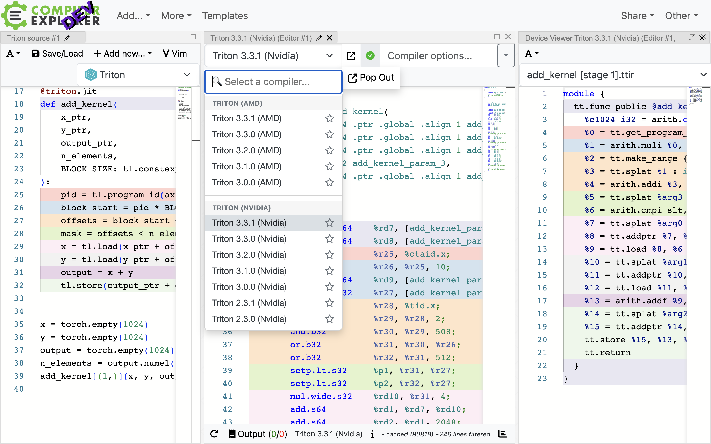
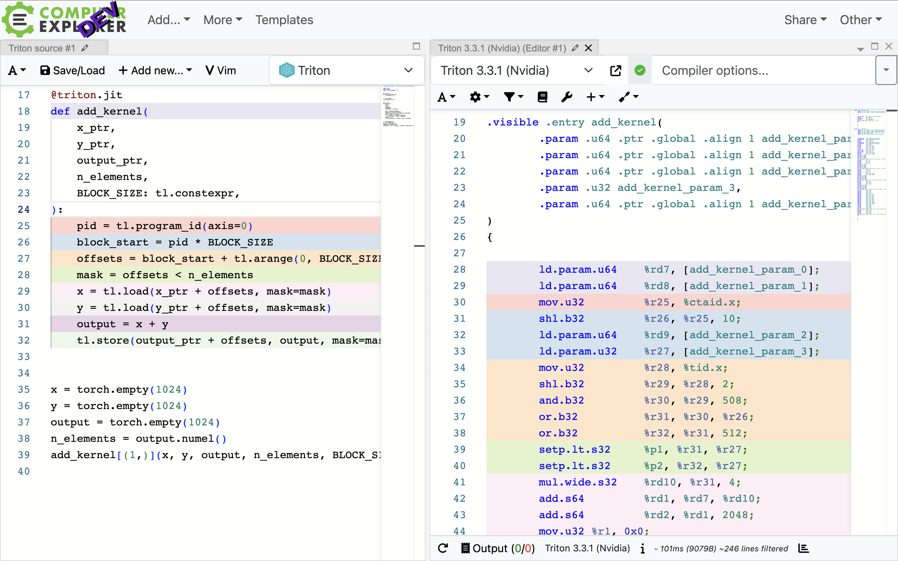
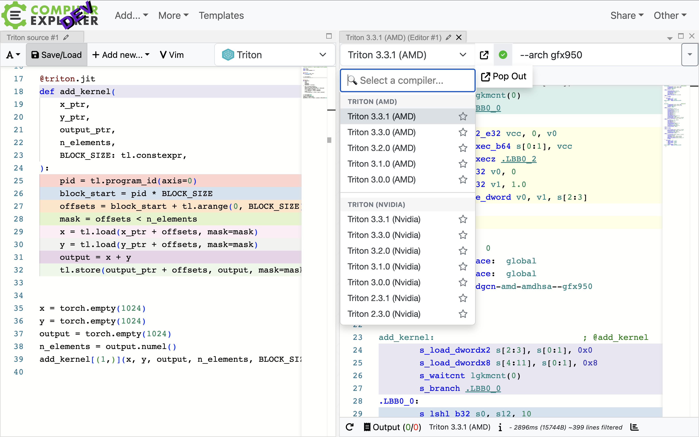
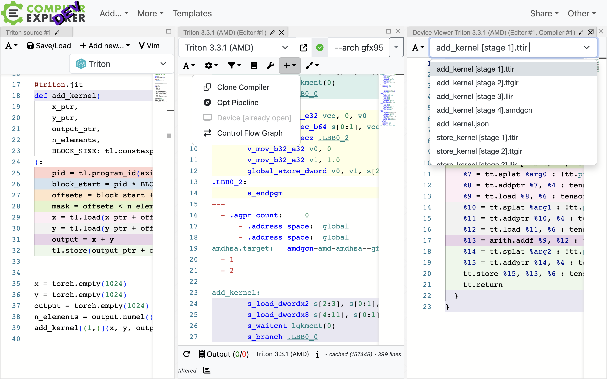
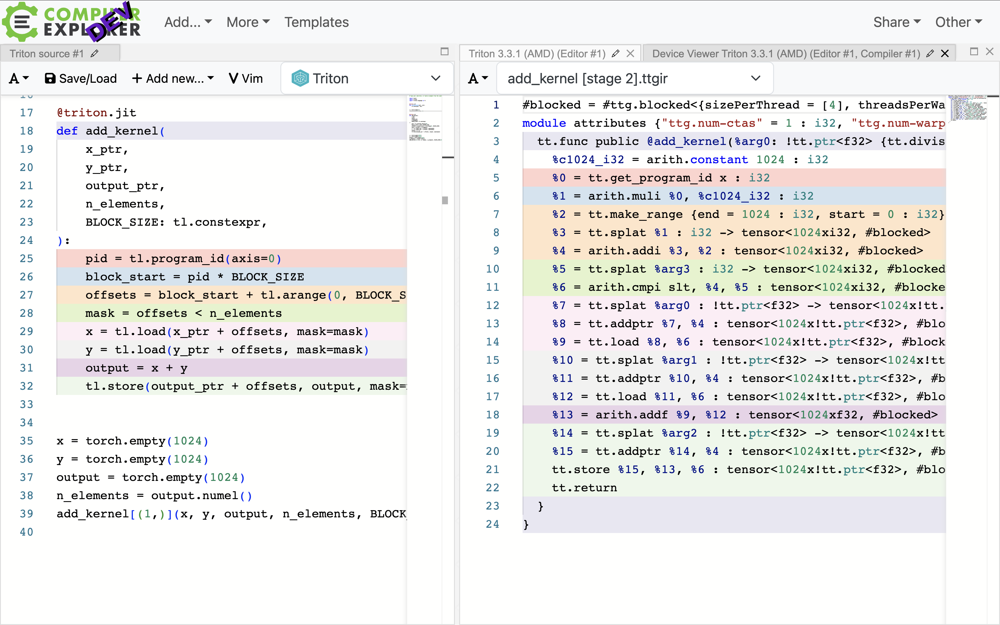
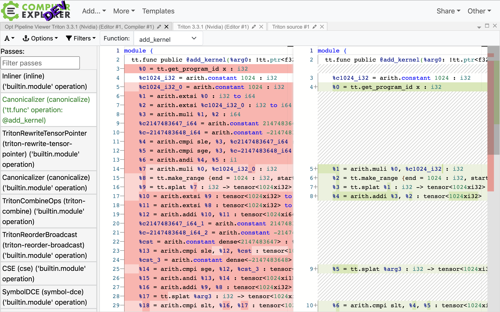
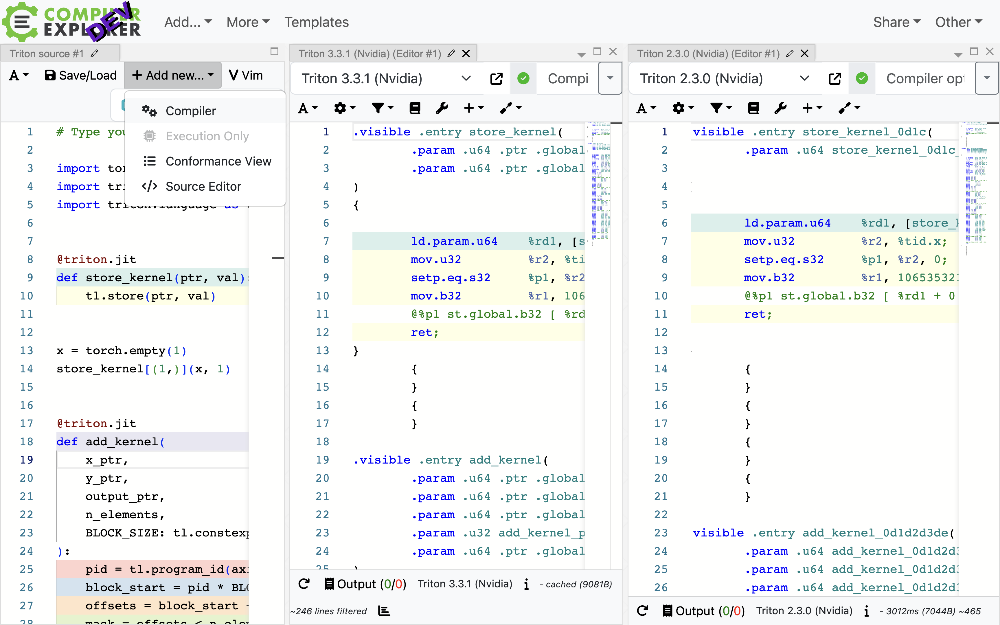
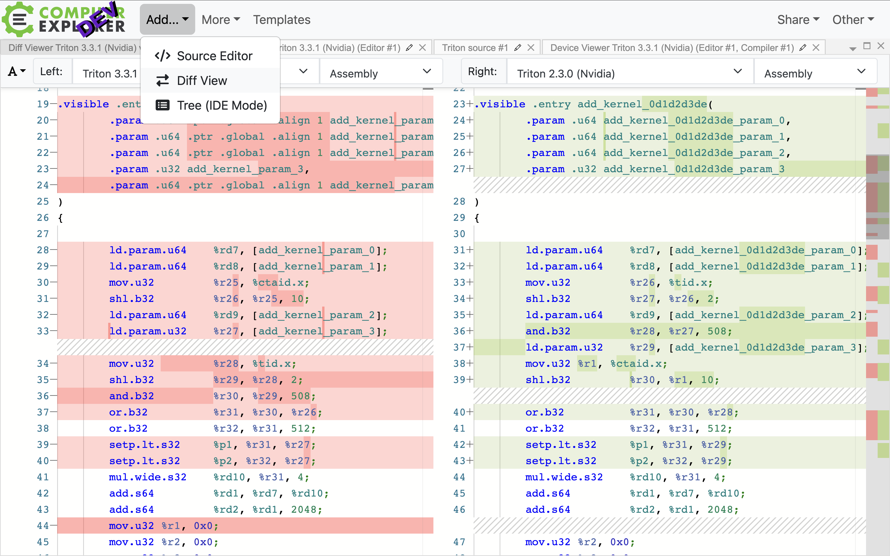
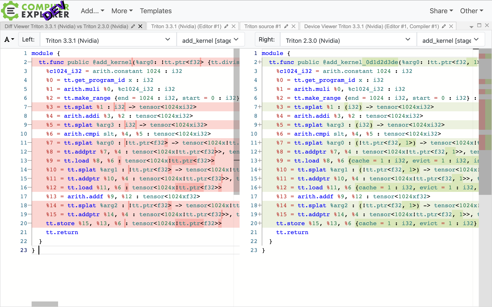

# Triton Support in Compiler Explorer

This [project](https://github.com/ShawnZhong/compiler-explorer-triton) integrates [Triton](triton-lang.org), a domain-specific language and compiler for GPU kernels, into [Compiler Explorer](https://godbolt.org/) (PR [#7919](https://github.com/compiler-explorer/compiler-explorer/pull/7919)). This allows users to interactively explore and debug the assembly output of Triton kernels, visualize intermediate compilation steps, and understand the MLIR optimization pipeline.



The project aims to achieve the following objectives:
- **Insights**: Improves the accessibility of Triton development and research by providing a user-friendly interface for exploring and understanding the intricacies of Triton compilation.
- **Debugging**: Simplify the process of identifying and resolving issues in Triton kernels, particularly differences across Triton versions.
- **Optimization**: Enables users to experiment with Triton programs and observe the resulting assembly to identify optimization opportunities.

## Features
**Online Compilation and Inspection**: Compile Triton kernels online and view various intermediate representations in your browser:
- TTIR (Triton MLIR)
- TTGIR (Triton GPU MLIR)
- LLVM IR
- PTX/AMDGCN (GPU Assembly for Nvidia/AMD GPUs)
- SASS (Low-level Nvidia GPU Assembly)

**MLIR Pass Visualization**:
Support for dumping and diffing the optimization pipeline for MLIR, enabling detailed analysis of the compilation process.

**Support for Multiple Versions and Backends**:
- Nvidia: v2.3.0, v2.3.1, v3.0.0, v3.1.0, v3.2.0, v3.3.0, v3.3.1
- AMD: v3.0.0, v3.1.0, v3.2.0, v3.3.0, v3.3.1

**Diffing Output**:
- Across Triton versions: Identify changes with Triton version updates.
- Across source codes: Understand the impact of code changes on the compilation process.
- Across architectures: Compare the differences in generated assembly for different GPU architectures.

**Source Mapping**: Source mapping is implemented from Python source code to all MLIR dialects and GPU assembly.

## Tutorials

> [!NOTE]
> Triton support is currently under the process of upstreaming to Compiler Explorer. Please check the [pull request](https://github.com/compiler-explorer/compiler-explorer/pull/7919) for the latest status.
>
> In the meantime, please refer to the [Deploy Locally](#deploy-locally) section for a local deployment.

### 1. Explore Triton Kernels

To begin, select `Triton` as the language from the language dropdown. An example file for `store_kernel` and `add_kernel` will automatically load on the left. You can modify this file or replace it with your own Triton code. Compiler Explorer will automatically recompile the code and display the resulting assembly.
(Note: A Device Viewer window will open, which can be ignored for now.)



### 2.  Compiler Versions and Flags

In the compiler version dropdown, you can choose different Triton versions for Nvidia and AMD to observe the differences in the assembly output.

Additionally, you can specify a compiler flag next to the version dropdown. For instance, you can add `--arch gfx950` to the AMD compiler flag to compile the code for GFX950 GPUs. The default flags can be found by clicking the green checkmark button in between.



### 3. A Dive into Intermediate Compilation Steps

To explore the intermediate compilation steps, use the Device Viewer tab, which opens by default. If it is closed, you can reopen it by clicking the `+ Add New...` button in the assembly tab and selecting `Device` from the dropdown (see below).



In the Device Viewer, you can view the intermediate compilation steps, from TTIR, to TTGIR, to LLVM IR, to PTX/AMDGCN, and finally to SASS. You can also see the configuration file for the current compilation in the `.json` file.



### 4. [Advanced] A Deeper Dive into the MLIR Optimization Pipeline

For advanced users or Triton developers, you can explore the MLIR optimization pipeline by clicking the `+ Add New...` button in the assembly tab and selecting `Opt Pipeline` from the dropdown.

This will open a new tab displaying the MLIR optimization pipeline. The results are grouped by functions, and you can select the function you want to explore from the dropdown on the top left. You can see the resulting MLIR after each optimization pass, with changes highlighted in green.

Note: The optimization pipeline is available for Triton v3.3.0 and above.



### 5. [Advanced] Diffing Output Across Triton Versions

To compare differences across Triton versions, first add a new compiler by clicking the `+ Add New...` button in the source tab (not the assembly tab). Then, select the Triton version you wish to compare from the dropdown menu.

Note: The tabs can become cluttered, so it's recommended to move all tabs to the right and merge them into the same tab group.



Next, add a diff view by selecting `Add...` from the dropdown at the top of the page, next to the Compiler Explorer logo. In the diff tab, choose the two versions you want to compare.



By default, the tab will compare the assembly output, but you can also compare other files.



## Deploy Locally
1. Clone https://github.com/ShawnZhong/compiler-explorer-infra.git
2. Install Triton to `/opt/compiler-explorer/triton`:
    ```sh
    $ cd compiler-explorer-infra
    $ ./bin/ce_install install triton
    $ ls /opt/compiler-explorer/triton
    # v2.3.0  v2.3.1  v3.0.0  v3.1.0  v3.2.0  v3.3.0  v3.3.1
    ```
3. Clone https://github.com/ShawnZhong/compiler-explorer-triton.git
4. Run Compiler Explorer
    ```sh
    make EXTRA_ARGS='--language triton' dev
    ```
5. Enjoy


## Implementation

### Overview

To implement this integration, several components were developed:

- Triton Wrapper ([`triton_wrapper.py`](etc/scripts/triton_wrapper.py)): Compiles Triton kernels without executing them, eliminating the need for a GPU in the exploration environment. It generates compiler dumps and consolidates results for display in Compiler Explorer. Meticulous handling of cross-version differences in Triton's internal APIs was implemented to ensure broad compatibility.

- Compiler Explorer Integration ([`triton.ts`](lib/compilers/triton.ts)): Manages the frontend integration with Compiler Explorer, communicating between the user interface and Triton wrapper.

- MLIR Parser ([`asm-parser-mlir.ts`](lib/parsers/asm-parser-mlir.ts)): Parses MLIR assembly output with precise source location information, enabling the display of TTIR and TTGIR in the Device Viewer.

- MLIR Pass Dump Parser ([`mlir-pass-dump-parser.ts`](lib/parsers/mlir-pass-dump-parser.ts)): Parses MLIR optimization pass dumps for stage-by-stage diffing and visualization of the MLIR optimization pipeline.

### How to Compile Triton Kernels without running them (AOT Compilation)

A key challenge was to enable Ahead-of-Time (AOT) compilation of Triton kernels without requiring a GPU for execution.

**Background.** Triton kernels are compiled and executed in the following steps:

- The `@triton.jit` decorator creates a `JITFunction` object, but the actual compilation occurs when the kernel is invoked. At this stage, we lack access to the arguments used in kernel specialization (e.g., for constant propagation).
- Kernel compilation and execution typically happen when `h = kernel[grid](args)` is called (`JITFunction.run` is executed internally), and there is no clear separation between these two steps.
- `JITFunction.run` subsequently calls `triton.compile`, a low-level function that performs kernel compilation. However, it is too low-level for use in Compiler Explorer, as it requires altering user code to manually provide signatures and constants, which is not user-friendly.

**Solution.** To address these challenges, we mocked the `CompiledKernel` and `GPUDriver` classes to bypass the kernel execution step.

- `CompiledKernel` is a handle to a compiled kernel ready for execution. It is created by `torch.compile`, and subsecuqnelty used by `JITFunction.run` to launch the kernel. We mocked `CompiledKernel` using `unittest.mock.MagicMock` to create a no-op class. This allows us to bypass the kernel execution step while still enabling correct interaction of this class with other components.


- `GPUDriver`, the class responsible for executing the kernel, is also mocked as a no-op, except for `get_current_target`, which is used to determine the current GPU target, and `get_benchmarker`, which is used in auto-tuning. We set our mock driver with `triton.runtime.driver.set_active`. This prevents the loading of the CUDA/ROCm driver, which is unnecessary for compilation purposes and likely unavailable in the deployment environment.

### How to Dump the Intermediate Compilation Steps

During the development process, multiple methods were attempted to dump the intermediate compilation steps:

1. Setting environment variables `TRITON_KERNEL_DUMP` and `TRITON_DUMP_DIR`: These were introduced in Triton v3.2.0 (commit [ca469d7](https://github.com/triton-lang/triton/commit/ca469d7b6b6def316b5f5ee6ad2bd19dcb840bd8)) and are not available in earlier versions.

2. Patching `triton.runtime.cache.default_cache_dir`: This location is overridden by the `TRITON_DUMP_DIR` environment variable. However, this method is somewhat hacky, and we lack control over the content written to the directory. (Triton dumps the compiled kernels into a folder with a random name.)

3. Using hooks `triton.knobs.runtime.{jit_post_compile_hook,launch_enter_hook}`: This approach is used by [TritonParse](https://github.com/pytorch-labs/tritonparse), but the hooks are unavailable in older versions (see commits [0e92672](https://github.com/triton-lang/triton/commit/0e9267202532ed1709dcc12c636220cf239dc377) and [8505252](https://github.com/triton-lang/triton/commit/850525276426fb9814399a8e0ee8fdf744229b02)).

4. [Current Approach] Registering a new `CacheManager` in Triton to dump files to a specific location: This approach is used in the current implementation. The `CacheManager` interface has been available in all versions supported by Compiler Explorer. This method allows us to control the content of the dumped files and their storage location.

### How to Prepare the Tensor Arguments for Compilation

Triton requires a Tensor in GPU memory to be passed as an argument to the kernel; otherwise, it will throw an error like "Pointer argument (at 0) cannot be accessed from Triton (cpu tensor?)". Therefore, tensors must be prepared in GPU memory before calling the Triton kernel (e.g., `torch.rand(..., device="cuda")`).

However, we should assume that the deployment environment does not necessarily have a GPU. To address this challenge, we use [fake tensor](https://docs.pytorch.org/docs/stable/torch.compiler_fake_tensor.html) developed by the PyTorch team as part of TorchDynamo. A fake tensor behaves like a normal tensor but does not have a real memory allocation and is only used for compilation purposes. This approach removes the dependency on a GPU and makes it more efficient by saving memory consumption.

## FAQ

**Is auto-tuning supported?**

Yes and no. Since we only compile the kernel without executing it, auto-tuning cannot  determine the optimal kernel configuration. However, you can still write `@triton.autotune` in your code and see the ouput, which can be useful for debugging and understanding the impact of different configurations on the generated assembly.

**Where are the Triton packages sourced from?**

The Triton packages are sourced from the PyPI package index (https://pypi.org/project/triton). These are the same packages you would receive when executing the command `pip install triton==x.y.z`.
Once the nightly build becomes available (refer to [issue #5967](https://github.com/triton-lang/triton/issues/5967)), it will also be supported.


**Is source mapping among IRs supported?**

Source mapping is implemented from Python source code to all MLIR dialects and GPU assembly. The source locations among IRs are derived from the Python source code. Due to constraints in Compiler Explorer, direct source mapping between different IRs (e.g., `USE_IR_LOC={ttir,ttgir}`) is not easily implementable.


## Contact

We're excited to see how this project can help the Triton community and look forward to hearing your thoughts and suggestions.

For bugs, questions, or feature requests, please use the [GitHub issue tracker](https://github.com/ShawnZhong/compiler-explorer-triton/issues).
